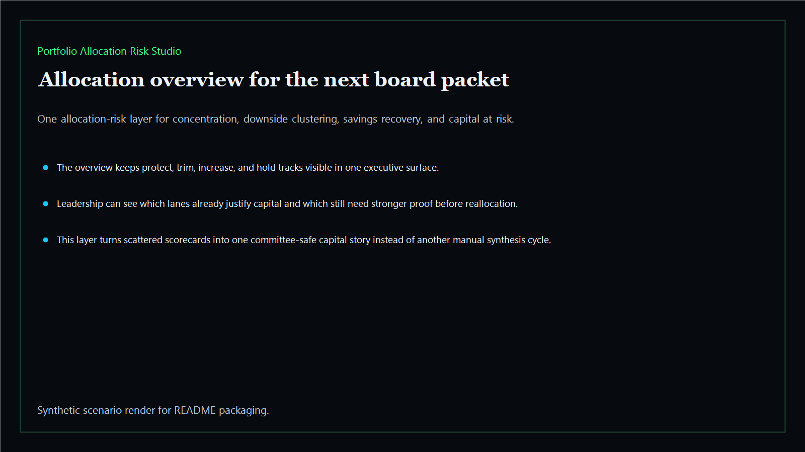
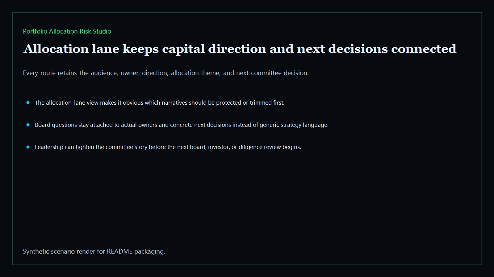
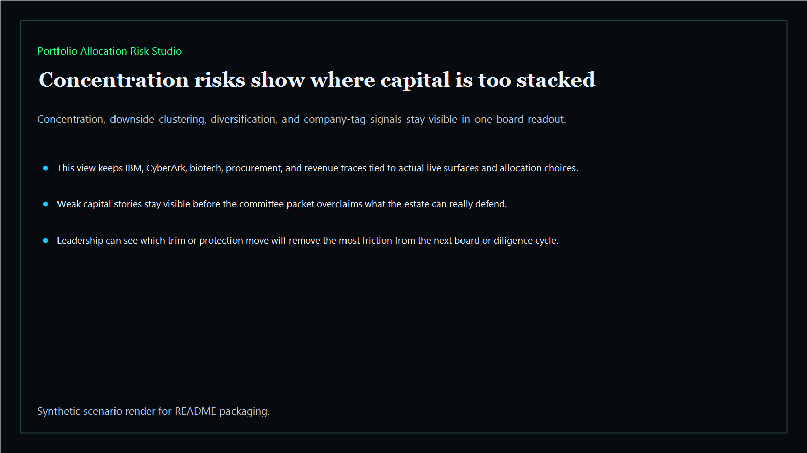
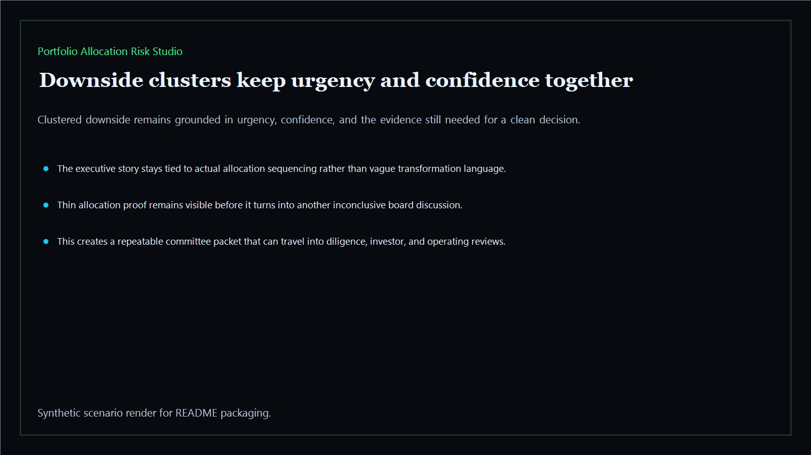

# Portfolio Allocation Risk Studio

Board-ready allocation-risk layer for concentration, downside clustering, and capital-misalallocation pressure across the Kinetic Gain estate.

- Live: `https://allocation.kineticgain.com/`
- Repo: `mizcausevic-dev/portfolio-allocation-risk-studio`

## Why this matters

Leaders need more than isolated scorecards. They need one allocation-risk layer that shows where capital is too concentrated, where clustered downside is building, what should be protected, and what should be trimmed before the next board or diligence room.

## What it includes

- TypeScript allocation-risk surface with concentration, downside-clustering, savings-recovery, and board-confidence scoring
- synthetic executive lanes across AI, identity, revenue, FinTech, biotech, procurement, and public-sector readiness
- reusable outputs for trim-versus-protect decisions, capital-at-risk rollups, concentration pressure, and committee-ready risk maps
- prerendered static site, JSON payloads, screenshots, and docs

## Routes

- `/`
- `/allocation-lane`
- `/concentration-risks`
- `/downside-clusters`
- `/verification`
- `/docs`

## Local run

```bash
cd portfolio-allocation-risk-studio
npm install
npm run verify
npm run prerender
npm run render:assets
```

## CLI

```bash
npx portfolio-allocation-risk-studio fixtures/portfolio-allocation-risk-studio.json --format summary
npx portfolio-allocation-risk-studio fixtures/portfolio-allocation-risk-studio-clean.json --format json
```

## Docs

- [Architecture](docs/architecture.md)
- [Origin](docs/ORIGIN.md)
- [Kinetic Gain Embedded](docs/KINETIC_GAIN_EMBEDDED.md)

## Screenshots





